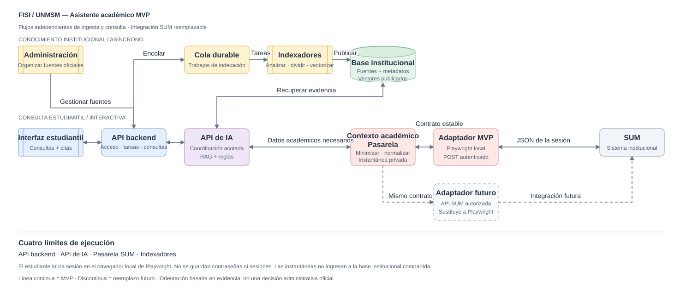

# Asistente académico FISI / UNMSM — arquitectura del MVP

[Abrir el diagrama editable de draw.io](docs/arquitectura.drawio)

[Arquitectura detallada de la consulta estudiantil: componentes, secuencia, contratos de API y transmisión](docs/arquitectura-detallada-estudiante.md)

[Separación de servicios: responsabilidades, contratos, propiedad de datos y estructura de servicios](docs/separacion-servicios.md)

[Arquitectura integral del AI Service y la consola administrativa de RAG](docs/superpowers/specs/2026-10-03-ai-service-admin-rag-design.md)

[Implementación administrativa: componentes, límites, métricas, despliegue y operación](docs/ai-service.md)

## Qué significa backend

El **sistema backend** reúne cuatro servicios: **Backend API**, **AI Service**, **Indexer Service** y **SUM Gateway**. Cada uno tiene su propio proceso, configuración y límites de concurrencia. AI Service e Indexer Service forman parte del sistema backend, pero se despliegan por separado de Backend API. Pueden compartir repositorio y máquina durante el MVP.

Backend API es la entrada pública para las interfaces. AI Service, Indexer Service y SUM Gateway son internos. La cola, Inngest y el almacenamiento son infraestructura; no sustituyen a los servicios que ejecutan el código de la aplicación.

## Dos flujos independientes

**Conocimiento institucional:** interfaz de administración → Backend API → cola durable de ingesta → Indexer Service → base de conocimiento institucional publicada.

El personal administrador organiza las fuentes oficiales, sus versiones, aplicabilidad, modificaciones y relaciones. Los trabajadores analizan, dividen en fragmentos y generan representaciones vectoriales con concurrencia limitada. Una versión pasa a estar disponible para búsqueda cuando termina el procesamiento. El símbolo de la base de conocimiento representa el almacenamiento de fuentes, sus metadatos y relaciones, y el índice de recuperación; no exige una base de datos física específica.

**Consulta estudiantil:** interfaz estudiantil → Backend API → despacho durable → AI Service → recuperación institucional y, cuando haga falta, SUM Gateway → orientación con citas devuelta mediante Backend API.

AI Service coordina un conjunto acotado de herramientas: recuperación de evidencia, consulta de relaciones entre documentos, solicitudes de contexto académico estrictamente delimitadas y comprobaciones deterministas codificadas de forma explícita. La recuperación y las comprobaciones empiezan como módulos internos de AI Service. El contexto personal es opcional para las consultas regulatorias generales.

## Límites de ejecución

| Servicio desplegable | Responsabilidades | Acceso |
|---|---|---|
| Backend API | Autenticación, control de acceso, documentos y versiones fuente, trabajos, consultas, resultados y SSE. | API pública y contratos internos autenticados. |
| AI Service | Flujos acotados, herramientas, recuperación de fuentes publicadas, reglas y síntesis con citas. | Host interno del flujo de consultas. |
| Indexer Service | Análisis asíncrono, división en fragmentos, vectores y publicación de una versión completa del índice. | Consumidor de trabajos de ingesta; host interno si usa Inngest. |
| SUM Gateway | Conexiones, extracción mediante adaptador, minimización, normalización e instantáneas privadas. | Contrato interno de contexto académico. |

Cada servicio se ejecuta como proceso o contenedor separado, incluso en una misma máquina. Indexer Service puede tener varios trabajadores. Sus límites y los del navegador se configuran independientemente de las consultas interactivas. El indexador construye el índice; AI Service lo consulta con permisos de lectura. Backend API recibe progreso y resultados mediante contratos internos y es el único servicio que modifica el estado de las consultas y trabajos. SUM Gateway administra sus propias instantáneas. La arquitectura no presupone una tecnología de proveedor específica.

## Conexión SUM del MVP

El estudiante inicia sesión directamente en SUM desde un navegador local, visible y controlado por Playwright. El adaptador utiliza esa sesión autenticada para enviar la solicitud POST requerida y obtener JSON. No reutiliza una sesión de una ventana de navegador ajena al flujo.

La pasarela valida la respuesta, selecciona únicamente los campos solicitados, los normaliza y elimina identificadores innecesarios antes de devolver los datos a la API de IA. Las contraseñas y el estado de la sesión del navegador no se guardan. Al desconectarse, se cierra el contexto; las instantáneas de consulta se eliminan al terminar la consulta. Las fechas de las instantáneas y los campos faltantes permiten expresar la incertidumbre de forma explícita.

Las instantáneas del estudiante permanecen separadas del corpus institucional compartido y nunca se incorporan a su índice vectorial. Los datos minimizados o seudonimizados no deben describirse como anónimos garantizados.

## Integración institucional futura

El adaptador punteado representa un reemplazo propuesto; no es una integración existente ni una dependencia adicional del sistema en ejecución. Un adaptador autorizado para la API de SUM implementaría el contrato de datos académicos de la pasarela en lugar de Playwright. La autenticación institucional, los permisos y los campos devueltos tendrían que ajustarse a la API real.

El flujo de razonamiento, la minimización de campos, las comprobaciones deterministas y las citas no dependen de la automatización del navegador. Backend API solicita a SUM Gateway la creación o revocación de conexiones; AI Service solicita el contexto permitido. Solo el adaptador de la pasarela se conecta a SUM.

## Fallos y respuestas

- Las solicitudes administrativas pesadas esperan en cola mientras los estudiantes consultan el último índice publicado.
- Si SUM falla, sigue disponible la orientación general basada en documentos; las comprobaciones personalizadas muestran datos faltantes o desconocidos, no una conclusión negativa de elegibilidad.
- Las comprobaciones deterministas se limitan a reglas codificadas explícitamente; las demás respuestas son interpretaciones con citas.
- Las respuestas ofrecen orientación respaldada por evidencia, no decisiones administrativas oficiales.

## Convenciones del diagrama

Las conexiones continuas representan el MVP inicial con datos simulados; las discontinuas, el reemplazo futuro del adaptador. El recinto del sistema backend contiene servicios independientes e infraestructura compartida. La figura muestra una arquitectura lógica de alto nivel, no una especificación de red ni de endpoints.

Después de editar el archivo `.drawio` en diagrams.net, exporta el SVG a `docs/arquitectura.svg` para actualizar la imagen incluida.

## Implementación de indexación

Backend API e Indexer Service se ejecutan por separado. El flujo implementado, los contratos y el arranque local se detallan en la [guía del indexador](docs/indexer-service.md). El flujo estudiantil, AI Service y SUM Gateway permanecen como diseño.
