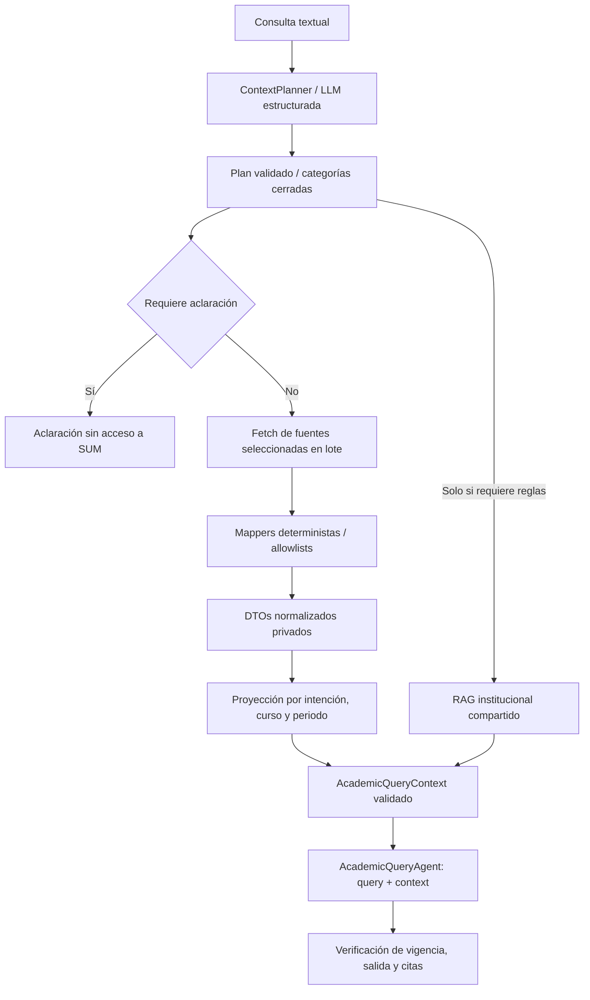

# Contexto académico mínimo por consulta

## Decisión y fundamento

Toda interpretación de intención, cursos y periodo se hace mediante una LLM con salida estructurada. Se eliminaron los patrones regex de ambos planners a petición del usuario. El planner recibe exclusivamente `{ query }`; no tiene herramientas SUM, expediente, sesión, notas ni conexión.

La LLM propone `AcademicQueryPlan`. El código valida intención, entidades y categorías contra una política cerrada. Después determina qué endpoints acceder, normaliza mediante allowlists y construye una proyección específica. El agente académico recibe exclusivamente `{ query, context }` como datos de la consulta. Identificadores de conexión/snapshot, autenticación y fechas permanecen en la envoltura del servidor.

Recomiendo esta arquitectura para consultas académicas abiertas. No se ha demostrado que sea la opción con mejor coste o precisión para SUM: falta evaluar preguntas reales con el modelo configurado. Las pruebas de esta entrega verifican privacidad y proyección con respuestas de clasificador controladas, no la comprensión lingüística de un modelo externo.

- [Anthropic: Building effective agents](https://www.anthropic.com/engineering/building-effective-agents) describe clasificación y routing hacia tareas especializadas y recomienda medir el beneficio de cada complejidad añadida. También reconoce clasificadores tradicionales como alternativas válidas. Este fundamento arquitectónico es de 2024; no constituye un benchmark de SUM.
- [OpenAI: Structured model outputs](https://developers.openai.com/api/docs/guides/structured-outputs) advierte que cumplir el esquema no evita errores semánticos. Por eso se admite `OTHER`, que solicita aclaración sin cargar datos, y las salidas inválidas fallan antes de acceder a SUM.
- [LangChain: Structured output](https://docs.langchain.com/oss/python/langchain/structured-output) documenta la validación Pydantic de `ToolStrategy`, utilizada en el servicio; Zod valida el mismo plan en la integración TypeScript.
- [Liu et al., Lost in the Middle, TACL 2024](https://aclanthology.org/2024.tacl-1.9/) mostró degradación según posición de información relevante en contextos largos para los modelos estudiados. Apoya seleccionar contexto relevante; no prueba por sí mismo precisión superior con todos los modelos actuales.

La interpretación semántica añade una llamada con coste y latencia. Se limita a una llamada de planificación y comparte la cuota del usuario y presupuesto de la respuesta. No se utiliza una puntuación de confianza inventada como autorización de acceso. Ante falta de entidad o ambigüedad, se solicita aclaración; ante esquema inválido, se devuelve un error seguro.

## Arquitectura implementada



La clasificación real del servicio utiliza LangChain. El planner TypeScript permite inyectar una LLM que devuelva el contrato Zod; exige que ese clasificador esté configurado. El gateway recibe el plan ya clasificado y no hace otra interpretación ni otra llamada a modelos.

`AcademicContextBuilder.build(query, studentSession)` planifica y proyecta. `buildFromPlan` reutiliza el plan del AI service. Las fuentes requeridas se consultan en `Promise.all`, una vez por endpoint. Las relaciones de prerrequisitos se resuelven en memoria; no hay solicitudes por curso. `StudentSession.collect()` usa caché y lock por consulta; el catálogo de tools por intención opera sobre esa proyección sin poder ampliar categorías. Ver [tools deterministas de pre-matrícula](pre-enrollment-tools.md).

Se eliminó la serialización completa de `AcademicSnapshot` hacia modelos/herramientas. El servicio rechaza el contrato antiguo y respuestas v2 con categorías o campos no autorizados. RAG se invoca únicamente cuando figura `INSTITUTIONAL_RULES`: máximo tres fragmentos de 800 caracteres. Las consultas puramente SUM no necesitan publicaciones ni citas institucionales ficticias.

## Inspección de los tipos RAW

Los tres archivos originales de `UI/types-SUM` permanecen intactos. `integrations/sum/types/index.ts` solo los reexporta con nombres de integración.

| Estructura real | Campos útiles / normalización | Campos que no se exponen al modelo |
|---|---|---|
| `HistorialResponse.data.historial[]` | `codAsignatura`, `desAsignatura`, `creditos`, `calificacion`, `codSemestre` → curso, créditos, nota, periodo; resultado derivado por política revisada | `codAlumno`, facultad/escuela/especialidad, sección, ciclo, actas, resoluciones y campos técnicos |
| Historial: `criterioCalificacion` | Entrada privada de la política de calificación; no se copia al contexto | `anioIngreso`, promedios, metadatos; `creditaje` se omite porque sus claves no tienen semántica declarada |
| `PlanResponse.data[]` | Curso y relaciones de `codAsignaturaPre`, `desAsignaturaPre`, `codGrupoPre`, `creditosPre`; agrupar filas repetidas por curso | Identificadores administrativos y de alcance; `codPlan` se usa solo para seleccionar el plan, tras recortar espacios |
| Plan: `creditos`, `tipoAsignatura`, `codGrupo` | Créditos/tipo para pendientes; grupos y relaciones para prerrequisitos | Créditos/tipo no se envían para una mera definición de prerrequisito |
| `ProgramacionResponse.data.programacion[]` | Código/nombre, sección y `horarios[]`: `dia`, `horaInicio`, `horaFin`, `codAula`, `codTipoHoraAsignatura` | Identidad del docente, aforo, conteos de matrícula, minutos redundantes e identificadores internos |
| `ProgramacionResponse.data.alumno` | El mapper de programación no lee este bloque | Apellidos, nombre, correo, fotos, identificadores, encuesta, ponderado, situación administrativa, ticket y demás perfil |
| `message`, `codError`, estructuras técnicas | Gestión del adapter | Nunca se propagan al contexto |

Privado: historial y selectores de conexión/plan. Compartido: definiciones curriculares/programación institucional y documentos publicados. El puerto del adapter debe obtener/cachear currículo por facultad, escuela, especialidad y plan, sin duplicar documentos institucionales en el expediente privado. El plan del estudiante es un selector del servidor, no un documento completo dentro de cada prompt.

## Tipos y esquemas finales

Los contratos ejecutables se encuentran en `UI/src/academic/context/schemas.ts` y su equivalente de frontera en `packages/contracts/src/sum_contracts/academic.py`.

```ts
type AcademicContextRequirement =
  | 'ACADEMIC_HISTORY'
  | 'STUDY_PLAN'
  | 'ACADEMIC_PROGRAMMING'
  | 'INSTITUTIONAL_RULES'

interface AcademicQueryPlan {
  intent:
    | 'COMPLETED_CREDITS' | 'COURSE_STATUS' | 'GRADE_QUERY'
    | 'CHECK_COURSE_ELIGIBILITY' | 'CHECK_PREREQUISITE_FULFILLMENT'
    | 'CHECK_PREREQUISITES' | 'GET_COURSE_SCHEDULE'
    | 'LIST_AVAILABLE_COURSES' | 'REMAINING_COURSES'
    | 'GENERAL_ACADEMIC_RULE' | 'CHECK_SCHEDULE_CONFLICTS'
    | 'CHECK_CREDIT_LOAD' | 'SIMULATE_ENROLLMENT' | 'OTHER'
  entities: {
    courseCodes?: string[]; courseNames?: string[]; term?: string
    sections?: { courseCode?: string; courseName?: string; section: number }[]
    preferences?: { avoidDays?: string[]; earliestStartMinutes?: number; latestEndMinutes?: number; preferredMaxCredits?: number }
  }
  requirements: AcademicContextRequirement[]
}

type AcademicQueryContext = {
  academicHistory?:
    | { completedCredits: number | null; unresolvedCourses?: number }
    | { courses: { courseCode: string; status: CourseStatus }[] }
    | { courses: { courseCode: string; status: CourseStatus; grade: number; term: string }[] }
  studyPlan?: { courses: ProjectedPlanCourse[]; progressVerified?: boolean }
  academicProgramming?: { courses: ScheduledCourse[] | OfferedCourse[] }
  institutionalRules?: { chunks: { citationId: string; text: string }[] }
}
```

`CourseStatus` es `PASSED | FAILED | WITHDRAWN | UNKNOWN | NOT_TAKEN`. `NOT_TAKEN` solo se deriva con historial completo certificado por el adapter. Los DTOs normalizados también son estrictos: `historyDomainSchema`, `planDomainSchema`, `programmingDomainSchema`. El esquema final rechaza campos adicionales en todos los niveles; `validateContextForPlan` además comprueba categorías, campos según intención y relación de cursos/periodos con el plan.

Límites: 5 entidades de curso, 300 cursos proyectados, 100 nodos de grafo y 16 000 caracteres de contexto; fuentes normalizadas tienen límites independientes. Si se exceden, se debe acotar la consulta; no se trunca silenciosamente el expediente para inventar conclusiones.

## Ejemplos de planes

Salidas ilustrativas esperadas del clasificador semántico, no resultados de una evaluación con una LLM real:

| Consulta | `intent` | Entidades | Categorías |
|---|---|---|---|
| ¿Cuántos créditos he aprobado? | `COMPLETED_CREDITS` | `{}` | Historia |
| ¿Qué horario tiene Inteligencia Artificial? | `GET_COURSE_SCHEDULE` | `courseNames: ["Inteligencia Artificial"]` | Programación |
| ¿Cuál es el prerrequisito de Compiladores? | `CHECK_PREREQUISITES` | `courseNames: ["Compiladores"]` | Plan |
| ¿Ya cumplo los prerrequisitos para Compiladores? | `CHECK_PREREQUISITE_FULFILLMENT` | `courseNames: ["Compiladores"]` | Historia, plan |
| ¿Puedo llevar Compiladores? | `CHECK_COURSE_ELIGIBILITY` | `courseNames: ["Compiladores"]` | Historia, plan, reglas |
| ¿Qué cursos puedo matricular el próximo ciclo? | `LIST_AVAILABLE_COURSES` | `{}` | Historia, plan, programación, reglas |
| ¿Qué cursos me faltan para terminar? | `REMAINING_COURSES` | `{}` | Historia, plan |
| ¿Cuál es el reglamento para retiro de curso? | `GENERAL_ACADEMIC_RULE` | `{}` | Reglas |
| ¿Eso significa que ya puedo? sin referencia suficiente | `OTHER` | `{}` | Ninguna; pedir aclaración |

Ejemplo JSON:

```json
{"intent":"CHECK_PREREQUISITE_FULFILLMENT","entities":{"courseNames":["Compiladores"]},"requirements":["ACADEMIC_HISTORY","STUDY_PLAN"]}
```

## Ejemplos de contexto final

Datos sintéticos del fixture de pruebas; no corresponden a un estudiante real. El umbral del fixture es exclusivamente de pruebas. Tres cursos de cuatro créditos están aprobados, Base de Datos tiene nota 16 y Compiladores requiere PR. Se muestran solo los datos de `context`; el prompt siempre es `{ query, context }`.

### 1. ¿Cuántos créditos he aprobado?

```json
{"academicHistory":{"completedCredits":12}}
```

Sin política de aprobación revisada o sin historial completo, se conserva el desconocimiento:

```json
{"academicHistory":{"completedCredits":null,"unresolvedCourses":3}}
```

### 2. ¿Qué horario tiene Inteligencia Artificial?

```json
{"academicProgramming":{"courses":[{"courseCode":"IA","courseName":"Inteligencia Artificial","section":1,"schedule":[{"day":"LUNES","start":"08:00","end":"10:00","room":"A101","type":"T"}]}]}}
```

No historial, calificaciones, alumno ni programación de otros cursos.

### 3. ¿Cuál es el prerrequisito de Compiladores?

```json
{"studyPlan":{"courses":[{"courseCode":"CO","courseName":"Compiladores","group":"--","prerequisites":[{"courseCode":"PR","courseName":"Lenguajes de Programación","group":"--","credits":0}]}]}}
```

La definición usa solo el curso consultado y sus relaciones directas. La comprobación personal puede necesitar el grafo de ancestros.

### 4. ¿Puedo llevar Compiladores?

```json
{
  "academicHistory":{"courses":[{"courseCode":"PR","status":"PASSED"},{"courseCode":"CO","status":"NOT_TAKEN"}]},
  "studyPlan":{"courses":[
    {"courseCode":"CO","courseName":"Compiladores","group":"--","prerequisites":[{"courseCode":"PR","courseName":"Lenguajes de Programación","group":"--","credits":0}]},
    {"courseCode":"PR","courseName":"Lenguajes de Programación","group":"--","prerequisites":[]}
  ]},
  "institutionalRules":{"chunks":[{"citationId":"00000000-0000-4000-8000-000000000001","text":"Regla institucional publicada de ejemplo."}]}
}
```

No notas ni cursos ajenos. Este contexto permite describir prerrequisitos y lo pendiente de verificar; no certifica matrícula. La interpretación de grupos, restricciones de crédito y aplicabilidad normativa requiere reglas revisadas.

### 5. ¿Cuál es el reglamento para retiro de curso?

```json
{"institutionalRules":{"chunks":[{"citationId":"00000000-0000-4000-8000-000000000001","text":"Regla institucional publicada de ejemplo."}]}}
```

Sin ninguna llamada SUM ni datos privados.

### 6. ¿Qué nota obtuve en Base de Datos?

```json
{"academicHistory":{"courses":[{"courseCode":"BD","status":"PASSED","grade":16,"term":"2025-2"}]}}
```

Si el query especifica periodo, se filtran los intentos antes de proyectarlos. No se incorpora la nota de otro curso o periodo.

### 7. ¿Qué cursos me faltan para terminar?

```json
{"studyPlan":{"courses":[{"courseCode":"CO","courseName":"Compiladores","credits":4,"type":"O"},{"courseCode":"IA","courseName":"Inteligencia Artificial","credits":4,"type":"O"}],"progressVerified":true}}
```

El historial se utiliza para derivar esta lista y desaparece del contexto final. `progressVerified=false` señala que no puede afirmarse una lista exhaustiva de pendientes. Una lista de electivos no equivale a una obligación de aprobarlos todos.

## Gateway y condiciones pendientes

`HttpAcademicGateway` solicita `POST /internal/academic-context`, autenticado por el servicio:

```json
{
  "schema_version":"academic-context-v2",
  "run_id":"UUID",
  "owner_id":"student:SHA256(subject)",
  "connection_id":"UUID",
  "query":"¿Cuántos créditos he aprobado?",
  "plan":{"intent":"COMPLETED_CREDITS","entities":{},"requirements":["ACADEMIC_HISTORY"]}
}
```

El servidor devuelve `AcademicContextEnvelope`: `schemaVersion`, `source`, `snapshotId`, `retrievedAt`, `expiresAt`, `context` y `missingRequirements`, además de `policyScope` opcional para reglas revisadas. Solo `context` se pasa a la LLM. `createAcademicGatewayHandler` proporciona la frontera HTTP con autorización y resolución de sesión inyectadas, validación estricta y errores seguros. No se ha montado un endpoint ficticio: falta implementar/montar el SUMAdapter real y los verificadores de conexión/propiedad/consentimiento.

El gateway no devuelve RAG. La evidencia institucional se obtiene y verifica en AI service. Se rechazan respuestas antiguas, sin expiración o con contenido institucional introducido por el gateway. La expiración se verifica antes de componer y antes de publicar.

Supuestos que debe confirmar SUMAdapter:

1. Historia completa: no hay bandera de completitud en los tipos RAW. El adapter debe certificarla; por defecto se considera parcial.
2. Política de calificación: no hay status aprobado/reprobado/retiro explícito. `ReviewedGradingPolicy` debe resolverlo de forma determinista con una versión revisada. Sin política, `UNKNOWN`; no se configura 11 como umbral de producción.
3. `creditaje` tiene claves arbitrarias sin descripción; no se supone que una de ellas significa créditos aprobados. Se suman cursos aprobados únicos, no intentos; créditos contradictorios de un mismo curso fallan.
4. El plan repite cursos por relación de prerrequisito. Se agrupan/deduplican relaciones; filas contradictorias fallan. No se interpreta `GEG` o `--` como AND/OR. Relaciones solo por grupo/créditos se conservan con `courseCode` y `courseName` nulos, sin inventar un curso.
5. `codPlan` incluye espacios y un literal estrecho en el tipo actual. Se recortan valores durante normalización, sin alterar el tipo RAW. Facultad/escuela/especialidad siguen siendo necesarias para delimitar correctamente la fuente compartida.
6. Programación debe corresponder al periodo solicitado; SUMAdapter recibe `term` cuando es explícito. La ausencia de periodo explícito no prueba disponibilidad del próximo ciclo. No se garantiza matrícula por existir un horario.
7. Créditos por equivalencias, electivos/grupos de egreso y excepciones institucionales necesitan semántica revisada; los tipos solos no la proporcionan. La proyección básica no certifica egreso o elegibilidad.
8. El emparejamiento de curso usa códigos o nombres normalizados y coincidencia exacta. Los nombres ambiguos requieren código; una referencia no resuelta produce una selección vacía, nunca toda la fuente.

El registro legado de reglas revisadas se conserva, pero la herramienta que utilizaba el snapshot completo no se expone en esta ruta. Evaluar otras consecuencias personales requiere una nueva proyección mínima revisada; no se usa el expediente entero como fallback.

## Auditoría y pruebas

Se mantienen cuotas Redis por estudiante y presupuesto compartido. Se auditan intención, categorías, tamaño, fuente/snapshot, etapas, herramientas, uso por llamada, publicaciones/citas y resultado privado. No se registran respuestas RAW, notas dentro de eventos de contexto, tokens, cookies ni headers. LangSmith conserva inputs/outputs ocultos. El adapter puede añadir el callback `audit` del builder con versión de política revisada y sin valores del expediente.

`StudentAnalysis.answer_basis` distingue `published_rag`, `sum_projection` y `clarification`. Backend permite respuestas sin citas de corpus solo con base `sum_projection`, consulta estudiantil consentida, conexión, contexto disponible y snapshot identificado; las respuestas normativas conservan validación de citas. Esto evita exigir RAG para responder un total de créditos y conserva una fuente auditable separada.

Pruebas focalizadas:

```sh
# Desde UI
node --import ./tests/unit/register.mjs --test tests/unit/academic-context.test.mjs

# Desde raíz
uv run --no-sync pytest tests/test_academic_minimization.py -q
```

Cobertura: A–E solicitados, secretos inyectados en todos los niveles RAW, deduplicación de créditos, resultado desconocido sin política, fuentes nunca consultadas cuando no se necesitan, selección por entidad/periodo, ciclo de prerrequisitos, reglas de grupo/créditos, rechazo de contexto ajeno, frontera HTTP autenticada, prompt real `{query, context}`, caché del servicio, auditoría sin valores académicos, base SUM sin citas ficticias y clasificación semántica obligatoria incluso para preguntas aparentemente obvias.

Resultado de la ejecución focalizada: **19 pruebas TypeScript y 16 Python aprobadas**, incluyendo límites de tools en `tests/test_student_tool_boundaries.py`. Typecheck acotado de los módulos afectados y Ruff de los archivos afectados aprobados. No son pruebas de la precisión semántica de una LLM real ni de conectividad SUM.

No se ejecutaron SUM real, modelos de pago, suite completa ni build. La calidad del clasificador LLM y la funcionalidad del SUMAdapter quedan pendientes de evaluación posterior. Zod/Pydantic garantizan forma y políticas de acceso, no precisión semántica absoluta.

## Archivos creados/modificados

**Creados:**

- `UI/src/academic/context/context-requirement.ts`
- `UI/src/academic/context/context-planner.ts`
- `UI/src/academic/context/context-builder.ts`
- `UI/src/academic/context/projections.ts`
- `UI/src/academic/context/schemas.ts`
- `UI/src/integrations/sum/types/index.ts`
- `UI/src/integrations/sum/source.ts`
- `UI/src/integrations/sum/mappers/historial.mapper.ts`
- `UI/src/integrations/sum/mappers/plan.mapper.ts`
- `UI/src/integrations/sum/mappers/programacion.mapper.ts`
- `UI/src/integrations/sum/academic-gateway.server.ts`
- `packages/contracts/src/sum_contracts/academic.py`
- `services/ai-service/src/sum_ai/academic_planner.py`
- `services/backend-api/src/sum_backend/student_result.py`
- `UI/tests/unit/academic-context.test.mjs`
- `tests/test_academic_minimization.py`
- `docs/academic-context-minimization.md`

**Modificados:**

- `packages/contracts/src/sum_contracts/student.py` — base auditable de respuesta.
- `services/ai-service/src/sum_ai/student_context.py` — gateway v2 y contexto proyectado.
- `services/ai-service/src/sum_ai/student_runner.py` — planner semántico y RAG condicional.
- `services/backend-api/src/sum_backend/ai_repository.py` — persistencia de respuestas SUM sin citas de corpus.
- `UI/src/lib/student/contracts.ts` — esquema de base de respuesta compatible.
- `docs/student-assistant.md` — referencia a la arquitectura y contrato actualizados.

**RAW intactos:** `UI/types-SUM/historial-academico.ts`, `UI/types-SUM/plan.ts`, `UI/types-SUM/programacion-academica.ts`.


La ampliación del motor, catálogo, resultados de UI y archivos adicionales se documenta en [Tools deterministas de pre-matrícula](pre-enrollment-tools.md).
