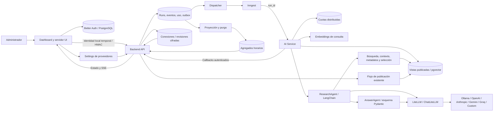

# Arquitectura integral administrativa y AI Service

## Responsabilidades

El [asistente estudiantil](student-assistant.md) incorpora UI con Vercel AI SDK, agentes contextuales y permisos/cuotas por usuario; SUMAdapter y gestión de conexiones siguen pendientes.

El administrador publica fuentes institucionales, consulta RAG y revisa citas, auditoría y métricas. El diseño aprobado está en [la especificación](superpowers/specs/2026-10-03-ai-service-admin-rag-design.md). Este documento describe el flujo administrativo; las integraciones estudiantiles y SUM Gateway requieren sus propios contratos y permisos.



| Componente | Responsabilidad |
| --- | --- |
| UI | Chat, Settings de proveedores, citas, herramientas, cancelación, historial y métricas; login disponible, actualmente deshabilitado en admin |
| Better Auth | Sesiones persistentes, contraseña procesada por la biblioteca, rol admin y allowlist; registro público deshabilitado |
| Backend API | Identidad, contratos, idempotencia, transacciones, outbox, auditoría y autorización por propietario de ejecución |
| Dispatcher / Inngest | Entrega durable de identificadores y ejecución acotada; un reintento del workflow |
| AI Service | Recuperación y agentes sin permisos SQL de escritura |
| PostgreSQL | Corpus publicado y auditoría durable; roles separados por servicio |
| Redis | Admisión, llamadas por proveedor, tokens por administrador y concurrencia atómicas |

## Consulta y auditabilidad

1. El servidor UI comprueba origen y firma identidad, método, ruta y SHA-256 del cuerpo durante 60 segundos. Backend exige también su token de servidor. Estado actual del panel: la autenticación fue deshabilitada y el proxy usa `local-admin`; `requireAdmin` y Better Auth permanecen disponibles para restaurar sesión, rol y allowlist antes de exponer el panel a usuarios distintos. La firma actual autentica el servidor UI y no demuestra una sesión humana.
2. Backend valida solicitud y catálogo. Un replay devuelve la ejecución existente; reutilizar la clave con otro cuerpo devuelve `409`. Redis confirma admisión antes de insertar una consulta nueva; los rechazos llevan `429` y `Retry-After`.
3. Una transacción inserta ejecución y outbox. Inngest recibe exclusivamente `contract_version` y `run_id`. AI obtiene el contexto del backend.
4. La recuperación inicial es obligatoria. `published_catalog` fija documento → generación sin recorrer vectores. Se verifica el perfil exacto, se consulta pgvector y se fusionan rankings por reciprocal rank fusion. Se admiten dos perfiles como máximo y 768 dimensiones. Un alcance global superior a 10 000 documentos exige selección explícita.
5. Antes de llamar al modelo, se persiste la evidencia inicial con IDs, ranking, perfiles de embeddings y SHA-256 del mapa documento → generación. Cada extracto conserva hasta 600 bytes UTF-8 de texto y 120 de localizador; se mantiene inspeccionable aunque el proveedor falle. Un cambio del mapa entre intentos devuelve `CORPUS_CHANGED`. `ResearchAgent` elige herramientas mediante el modelo: `search_published_chunks`, `get_published_chunk_context` y `get_publication_metadata` validan entradas y ejecutan consultas deterministas dentro del alcance fijado. `select_answer_evidence` selecciona hasta ocho fragmentos ya observados para la respuesta. Si no hay selección explícita, se priorizan los hallazgos recientes de herramientas. Los fragmentos se tratan como datos no confiables.
6. `AnswerAgent` utiliza hasta ocho fragmentos y salida Pydantic sin herramientas de negocio, con un intento de reparación. El código comprueba citas contra evidencia y verifica otra vez las publicaciones. Citas inválidas provocan abstención; un cambio de corpus termina con `CORPUS_CHANGED`.
7. Backend guarda resultado, evidencia y evento terminal en una transacción y reconcilia el uso del resultado con la suma de callbacks durables, incluidos intentos fallidos y embeddings. UI sigue SSE por secuencia, permite cancelar y reabre `/admin/chat?run_id=UUID` con la configuración original sin secretos y la evidencia inicial disponible.

Sin evidencia no se invoca el modelo. Se registran etapas, duraciones, herramientas, IDs de corpus, intentos y uso. No se solicita ni almacena razonamiento interno del modelo. Los IDs de callbacks deduplican reenvíos; cada nuevo intento tiene un prefijo propio. Una respuesta de proveedor perdida antes de persistir puede causar un segundo cobro en el reintento: cuotas y límites lo acotan, sin prometer exactamente una llamada externa.

Cancelar impide llamadas posteriores a la comprobación de contexto. Una llamada que ya fue enviada puede terminar y cobrar; se aceptan sus callbacks de uso sin cambiar el estado cancelado. Las respuestas conservadas son privadas del propietario administrativo de la ejecución; las fuentes consultadas son institucionales publicadas.

### Dashboard de LangSmith

El proyecto de admin usa una traza raíz `AdminRAG` que contiene `ResearchAgent`, `AnswerAgent`, llamadas al modelo y herramientas. La metadata `sum_run_id` correlaciona la consulta con PostgreSQL; `attempt_id` distingue reintentos. El evento local `admin:trace` conserva `trace_id`, proyecto y si el envío estaba habilitado. La traza no serializa el objeto de configuración ni las credenciales del proveedor.

Configurar en `.env` y recrear el servicio AI:

```dotenv
LANGSMITH_TRACING=true
LANGSMITH_API_KEY=tu_clave_de_langsmith
LANGSMITH_ADMIN_PROJECT=sum-admin-rag
LANGSMITH_ADMIN_CAPTURE_CONTENT=false
```

```sh
docker compose up -d --no-deps ai
```

Abrir [LangSmith](https://smith.langchain.com), entrar a `sum-admin-rag` y filtrar metadata `sum_run_id` por el ID de una consulta nueva. Expandir los nodos para revisar errores, herramientas, latencia y tokens. Una ejecución previa sin tracing no genera retroactivamente una traza externa. Para inspeccionar también prompts, argumentos y respuestas de admin, establecer `LANGSMITH_ADMIN_CAPTURE_CONTENT=true` y recrear AI; ese modo envía dicho contenido a LangSmith. Las trazas de estudiantes conservan su cliente con entradas y salidas ocultas.

Sin `LANGSMITH_TRACING=true` y una API key, el envío de admin permanece deshabilitado y la auditoría local sigue funcionando. Crear la clave en Settings → API Keys → Create API Key de LangSmith. Para una clave de organización, configurar también `LANGSMITH_WORKSPACE_ID`. `LANGSMITH_ENDPOINT` permite seleccionar el endpoint de la cuenta (por defecto `https://api.smith.langchain.com`; región EU: `https://eu.api.smith.langchain.com`). La integración sigue la documentación de [tracing con LangChain](https://docs.langchain.com/langsmith/trace-with-langchain) y [ocultamiento de entradas y salidas](https://docs.langchain.com/langsmith/mask-inputs-outputs).

### Argumentos de herramientas y recuperación

Los esquemas enviados al modelo describen los mismos límites que valida Python: búsqueda de 3–500 caracteres, `top_k` de 1–8, radio de contexto de 0–2 y selección de 1–8 UUID distintos. Los campos adicionales y tipos inválidos se rechazan antes de ejecutar la herramienta.

Un error de entrada recuperable devuelve un `ToolMessage` de error al agente, con el campo que debe corregir. El intento rechazado se conserva en la traza con nombre, argumentos acotados, explicación y `AI_TOOL_INPUT_INVALID`; cuenta dentro de las seis herramientas permitidas. La corrección del modelo comparte las cinco llamadas y el presupuesto de tokens existente. Las selecciones rechazadas no sustituyen evidencia válida. Cambios del corpus, alcance no autorizado, cancelación y límites de capacidad siguen interrumpiendo la ejecución.

Los códigos recuperables pertenecen a los eventos de auditoría. El campo `error_code` de la ejecución registra el fallo o la cancelación terminal; completar una ejecución borra cualquier código transitorio anterior. Un aviso de herramienta o de uso no convierte una respuesta completada en un fallo.

La ejecución `53672c77-3d5f-4b5e-9bea-8d8fefbd9cd5` mostró recuperación inicial y una búsqueda adicional exitosas, seguidas de un rechazo de entrada sin argumentos conservados. Por eso no es posible identificar retrospectivamente el parámetro concreto. El ajuste registra esos rechazos y evita que una entrada corregible termine inmediatamente toda la consulta; no reabre ni reejecuta ejecuciones terminales.

## Límites y eficiencia

El límite de pasos de LangGraph es independiente del número de llamadas al modelo. Investigación dispone de 32 pasos para ejecutar los nodos de middleware y cerrar después de sus tres llamadas; conserva el límite global de cinco llamadas y los presupuestos de tokens. Si el grafo supera sus pasos, se registra `AI_GRAPH_LIMIT` como fallo terminal, evitando que Inngest repita toda la investigación por un error de control del agente.

Antes de una llamada de investigación se reservan hasta 3 200 tokens de entrada, 400 de salida y una llamada para redactar. En presupuestos configurados menores, cada reserva de tokens se limita a la mitad del presupuesto correspondiente. Si la siguiente llamada consumiría la reserva, el middleware devuelve una conclusión determinista sin invocar al proveedor, cierra la investigación y continúa a composición con la evidencia recuperada. El evento `AI_RESEARCH_BUDGET_STOP` es recuperable y registra consumo, estimación siguiente, reserva y motivo. Esos datos también aparecen en metadata `budget_stop` de LangSmith, incluso con contenido oculto. El límite global sigue aplicándose a composición y al uso real informado por el proveedor.

Las herramientas de búsqueda y contexto exponen texto de hasta 800 caracteres por fragmento, su ID, documento, página y un indicador de truncamiento. Conservan internamente los registros completos para validar y auditar las citas. Esto reduce el historial enviado repetidamente al modelo. El presupuesto de entrada es acumulado: reenviar el historial en una segunda o tercera llamada consume entrada de nuevo.

| Recurso | Límite inicial |
| --- | --- |
| Entrada | Pregunta 3–2000 caracteres; 20 UUID; `top_k` 1–10 |
| Ejecución | 120 s; 5 llamadas al modelo; hasta 3 llamadas de investigación; 6 herramientas; 8 fragmentos |
| Generación | 8000 tokens de entrada estimados acumulados; 1000 de salida acumulados |
| Dependencias | SQL y conexión/pool 3 s; embeddings 10 s por petición; modelo 30 s; callback 5 s |
| Administrador | 10 solicitudes/minuto; 80 000 tokens reservados/minuto |
| Proveedor | 30 llamadas/minuto; 4 simultáneas, compartidas entre modelos e instancias |
| Reservas | Lease 130 s; limpieza por TTL; liquidación única por ID |
| Retención | Ejecuciones, respuestas, evidencia y eventos 30 días; agregados sin preguntas 90 días |

Las cuotas usan ventanas fijas de un minuto y Lua atómico. Redis falla cerrado antes de llamadas de pago. Repetir la misma admisión durante 120 s no consume otra solicitud; los reintentos de proveedor sí consumen cuota y presupuesto. Los inicios de llamada y el uso se recuperan del historial durable al reintentar el workflow: las cinco llamadas y el presupuesto de tokens se comparten entre intentos.

El costo es una estimación con tarifa y fecha configuradas. Los valores de `.env.example` son ejemplos que deben revisarse con el proveedor contratado. Si falta uso del proveedor, se estima por tamaño del contenido. Los embeddings OpenAI requieren tarifa explícita y comparten la cuota OpenAI. TEI verifica modelo y SHA; Ollama exige digest compatible con la publicación. OpenAI permite comprobar modelo y dimensión, pero no fijar un commit inmutable del servicio remoto.

## Métricas y evaluación

`/admin/metrics` filtra por período, proveedor, modelo, generación y estado. Muestra volumen, estados, abstenciones, cuotas, timeouts, tokens, costo, herramientas, promedio y p50/p95 aproximados por etapa. Los gráficos tienen tablas equivalentes y enlaces a ejecuciones que respetan los mismos filtros, paginadas de 20 en 20.

La proyección usa ejecuciones terminales pendientes de proyectar, con agregados y deduplicación en una transacción. Un cursor global de eventos podría omitir ejecuciones que terminan tarde. Cada 15 s procesa hasta 100 ejecuciones; las canceladas esperan 130 s para incluir uso de llamadas en curso. HTTP agrupa métricas en SQL; períodos superiores a 30 días usan intervalos diarios. Los agregados excluyen preguntas y respuestas. La purga elimina únicamente ejecuciones proyectadas. El uso por llamada permite contabilizar fallos además de resultados completados. Los rechazos de admisión `429`, anteriores a la creación de una ejecución, se cuentan por hora, propietario, proveedor y modelo en `ai_rejection_buckets`; se incluyen cuando no hay filtro de estado o generación, atributos que no existen para esos rechazos.

Los conjuntos `data/ai-evaluation/*.json` fijan pregunta, documentos, generaciones y fragmentos relevantes. Se validan al cargar y contra publicaciones antes de ejecutar. Las evaluaciones usan el mismo runner y cuotas, prioridad menor y concurrencia 1.

- `recall@k`: relevantes recuperados / relevantes etiquetados.
- `precision@k`: relevantes recuperados / k; posiciones ausentes cuentan como fallos.
- `MRR`: inverso de la posición del primer relevante, o cero.

Se evalúa el ranking inicial, antes de herramientas adicionales. La calidad etiquetada se separa del tráfico interactivo; sin etiquetas vigentes se muestra ausencia de evaluación. La fixture `admin-rag-v1.json` contiene IDs sintéticos y aparece indisponible en un corpus normal; instalar etiquetas propias para evaluar documentos reales. Validar identidad de citas no prueba corrección semántica, que requiere revisión humana.

## Escalabilidad

AI Service admite réplicas con el mismo Redis y rol SQL de lectura; el estado durable pertenece a Backend/Inngest. Cada proceso AI tiene pool de cinco conexiones; Backend usa su pool configurado. Ajustar réplicas exige presupuestar conexiones PostgreSQL y concurrencia distribuida de Inngest. Las cuotas Redis permanecen compartidas entre réplicas.

Se utiliza el índice HNSW de 768 dimensiones existente. El cache de embeddings de consulta usa hashes, TTL 120 s y máximo 500 entradas por proceso, sin sustituir comprobaciones de publicación. El historial tiene paginación, SSE reanuda por secuencia y las métricas leen agregados.

Las consultas Python del flujo AI usan tablas tipadas y expresiones SQLAlchemy Core, incluido el operador vectorial de `pgvector.sqlalchemy`. No pasan SQL textual por el adaptador heredado. Las migraciones permanecen en SQL; la migración general del indexador anterior queda fuera de este trabajo.

## Arranque y migraciones

Copiar `.env.example` a `.env`, configurar claves/modelos y reemplazar credenciales. PostgreSQL aplica `infra/postgres/` al inicializar un volumen nuevo. Para un volumen existente, con 001–005 aplicadas y el contenedor recreado para cargar `AUTH_DB_PASSWORD`:

```sh
docker compose exec -T postgres bash /docker-entrypoint-initdb.d/002_logins.sh
docker compose exec -T postgres psql -U sum -d sum -v ON_ERROR_STOP=1 < infra/postgres/006_ai_runs.sql
docker compose exec -T postgres psql -U sum -d sum -v ON_ERROR_STOP=1 < infra/postgres/007_admin_auth.sql
docker compose exec -T postgres psql -U sum -d sum -v ON_ERROR_STOP=1 < infra/postgres/008_ai_metrics.sql
docker compose exec -T postgres psql -U sum -d sum -v ON_ERROR_STOP=1 < infra/postgres/009_published_catalog.sql
docker compose exec -T postgres psql -U sum -d sum -v ON_ERROR_STOP=1 < infra/postgres/010_ai_providers.sql
docker compose exec -T postgres psql -U sum -d sum -v ON_ERROR_STOP=1 < infra/postgres/011_ai_admission_metrics.sql
docker compose up -d --build
```

La migración 007 crea tablas de autenticación: ejecutarla una sola vez. No borrar volúmenes al actualizar. AI y Redis solo se exponen en la red interna; Backend usa loopback `8000`, PostgreSQL loopback `5433`, e Inngest local `8288` registra ambos SDK.

Configurar `UI/.env.local` con `AUTH_DATABASE_URL` del rol `sum_auth`, `BETTER_AUTH_SECRET`, `AI_IDENTITY_SECRET`, `ADMIN_EMAIL_ALLOWLIST`, `BACKEND_ADMIN_TOKEN` y `BACKEND_API_URL`. El secreto HMAC debe coincidir con Backend. En producción, suministrar variables al proceso UI: el cargador local solo se usa en desarrollo/test.

Para crear el primer administrador al habilitar autenticación, establecer `ADMIN_BOOTSTRAP_EMAIL` dentro de la allowlist y `ADMIN_BOOTSTRAP_PASSWORD` de al menos 12 caracteres; ejecutar `cd UI && pnpm auth:bootstrap`. El script utiliza `auth.api.createUser` de servidor, falla si el correo existe y no imprime contraseñas. Retirar variables bootstrap después de crear la cuenta. En el estado local actual, iniciar `pnpm dev` y abrir `/admin/chat`, `/admin/metrics` y Settings directamente.

`AI_MODELS_JSON` admite Ollama, OpenAI API, Anthropic, Google Gemini, Groq y Custom, con herramientas y salida estructurada. “Codex” significa modelos disponibles por OpenAI API con clave. Los modelos sin clave figuran indisponibles. Una opción disponible indica configuración habilitada; el proveedor real se comprueba al ejecutar.

El `/health` interno verifica SQL y Redis, y devuelve un conteo de modelos sin secretos ni llamadas de pago. Compose usa Inngest de desarrollo; el despliegue productivo debe configurar su servicio autenticado y claves de firma/eventos.

## API

UI consume `/api/ai/*`; Backend expone `/v1/admin/ai/*`:

| Ruta relativa | Acción |
| --- | --- |
| `GET models` | Catálogo permitido |
| `GET/POST providers` | Listar/crear conexiones propias sin devolver claves |
| `POST providers/{id}` | Editar con `expected_revision`, creando una revisión |
| `GET providers/pricing` | Estimación de tarifas por proveedor/modelo, desde el catálogo local de LiteLLM |
| `POST providers/test` | Probar borrador o conexión guardada, sin modificar revisiones |
| `POST runs` | Crear con `Idempotency-Key` |
| `GET runs` | Historial por propietario; filtros de período, proveedor, modelo, generación y estado; `limit`/`offset` |
| `GET runs/{id}` | Estado, pregunta, resultado, evidencia inicial y revisión de configuración sin secretos |
| `GET runs/{id}/events` | SSE con `Last-Event-ID` o `after` |
| `POST runs/{id}/cancel` | Cancelar |
| `GET metrics` | Agregados filtrados |
| `GET/POST evaluations` | Conjuntos, resultados e inicio de evaluación |

Contexto y callbacks `/internal/ai/*` exigen `SERVICE_TOKEN`. Las herramientas no aceptan SQL arbitrario, URLs externas ni instrucciones que amplíen permisos.

## Verificación

Comprobación ligera del runner, sin servicios externos ni llamadas de pago:

```sh
uv run --no-sync pytest tests/test_ai_runner.py -q
```

Los comandos siguientes son una referencia para una validación completa posterior. Por indicación del usuario, no se vuelve a ejecutar la suite pesada de integración ni navegador en este cierre.

```sh
uv sync --locked
uv run pytest --ignore=tests/integration -q
docker compose --profile test build ai-test
docker compose --profile test run --rm ai-test pytest -p no:cacheprovider tests/integration/test_ai_published_retrieval.py tests/integration/test_ai_stack.py tests/integration/test_ai_providers.py tests/test_ai_quota.py tests/test_ai_repository.py -q
cd UI
pnpm test:unit
pnpm build
node node_modules/@playwright/test/cli.js test tests/e2e/ai-admin.spec.ts tests/e2e/ai-providers.spec.ts
```

La integración utiliza PostgreSQL/pgvector, permisos de lectura, Redis, API, LangChain, callbacks, SSE y proyección reales con modelo y embeddings sintéticos. El navegador cubre el panel con identidad local temporal y respuestas AI simuladas, incluyendo Settings en escritorio y móvil. Las pruebas de API comprueban firmas e identidad por propietario. Estas pruebas no validan respuestas de proveedores de pago.

El registro de resultados y limitaciones está en [el ledger de implementación](../.superpowers/sdd/2026-10-03-ai-service-admin-rag/progress.md). La última ejecución completa de integración detectó una serialización incorrecta del perfil de embeddings, corregida usando `dataclasses.asdict` y comprobada con el perfil real en la prueba ligera. La suite completa no se repitió después de esa corrección. La última suite de navegador quedó incompleta. El chequeo TypeScript global mantiene errores previos en páginas demo, fuera de este flujo.

Las dependencias AI están fijadas en `uv.lock` y `infra/ai-requirements.lock`. Regenerar este último con `uv export --locked --package sum-ai --no-dev --no-emit-workspace --format requirements-txt --output-file infra/ai-requirements.lock` después de cambiar dependencias.

## Proveedores en Settings

Settings utiliza **LiteLLM SDK** como transporte común, con la integración oficial `langchain-litellm`. LangChain sigue orquestando los agentes, herramientas y salida estructurada. No hace falta desplegar un proxy LiteLLM adicional. Las conexiones y revisiones existentes se conservan.

El formulario permite añadir y editar **Ollama, Gemini, Groq, OpenAI, Anthropic y Custom** con selector de proveedor, API key y modelo. La URL solo se solicita para Ollama/Custom. El nombre se genera automáticamente si se omite; prioridad, habilitación y tarifas manuales están en Opciones avanzadas. Guardar admite el modelo escrito directamente; el botón + permite añadir varios. La prioridad ordena el catálogo; no hay cambio automático de proveedor. Los modelos definidos por variables del servidor aparecen además de estas conexiones. Selección y evaluaciones envían ID y revisión junto al modelo.

Las tarifas conocidas se cargan del mapa incluido en la versión fijada de LiteLLM y quedan guardadas en la revisión, con la fecha de consulta. `LITELLM_LOCAL_MODEL_COST_MAP=True` impide descargar precios mutables al iniciar. No se promete que coincidan con el contrato o la tarifa vigente del proveedor. Ollama usa cero por tokens; Custom y modelos sin tarifa conocida requieren importes explícitos para guardar. La prueba de conexión puede ejecutarse aunque falten esas tarifas.

Backend cifra cada clave con Fernet usando `AI_PROVIDER_ENCRYPTION_KEY`. Generar una sola vez y conservarla junto con las copias de seguridad:

```sh
uv run python -c "from cryptography.fernet import Fernet; print(Fernet.generate_key().decode())"
```

Configurar el resultado exclusivamente en el entorno backend. Cambiarlo sin volver a cifrar las revisiones impide recuperar las claves anteriores. Los endpoints públicos solo devuelven `has_api_key`; una edición con clave vacía conserva la anterior si el tipo y la URL siguen iguales. Cambiar de tipo/URL exige introducir la nueva clave. Deshabilitar impide nuevas admisiones; las ejecuciones ya creadas siguen usando su revisión original. Las revisiones no se sobrescriben ni se borran al editar.

Los proveedores cloud usan endpoints oficiales fijos. Ollama/Custom requieren que el hostname pertenezca a `AI_PROVIDER_ALLOWED_HOSTS`, configurado por el operador. La URL debe ser accesible desde el contenedor AI; `localhost` allí significa ese contenedor. Para un servidor del host, usar `host.docker.internal` con el puerto correcto. Custom normaliza una URL terminada en `/chat/completions` a su base, por ejemplo `/v1`. El servidor debe soportar chat, herramientas y salida estructurada mediante herramientas. Guardar no realiza una llamada de pago ni demuestra las capacidades del modelo.

Todos los modelos del registro usan `ChatLiteLLM` con timeout 30 s y reintentos de la integración y del SDK en cero. El middleware del runner sigue controlando sus reintentos limitados y cuotas. La configuración usa los IDs originales del proveedor; el transporte añade `ollama_chat/`, `openai/`, `anthropic/`, `gemini/` o `groq/` según corresponda. Por ejemplo, `openai/gpt-oss-20b` de Groq se envía como `groq/openai/gpt-oss-20b`. Custom usa `openai/` con su URL compatible. Las claves se suministran por instancia, sin modificar variables globales por conexión.

Para modelos definidos mediante entorno, usar `GROQ_API_KEY` y una entrada `provider: "groq"` en `AI_MODELS_JSON`; para Settings, guardar la clave en el modal. Gemini utiliza API key (Google AI), no autenticación IAM de Vertex.

### Probar conexión

1. Introducir proveedor, modelo y clave, o editar una conexión existente dejando vacía la clave para conservarla.
2. Pulsar **Probar conexión**. Para varios modelos, seleccionar el que se quiere probar; el texto pendiente del campo Modelo tiene prioridad.
3. Backend valida propietario, revisión, URL y host permitido; recupera la clave guardada solo si proveedor y URL coinciden. No crea ni actualiza una revisión.
4. AI Service aplica la cuota de admisión y reserva 384 tokens con las cuotas Redis compartidas. Envía una sola llamada con límite de 128 tokens de salida y timeout 8 s. Comprueba que el modelo devuelva `connection_probe` con argumentos exactos `{"value":"ok"}`; no ejecuta herramientas de negocio ni consulta documentos.
5. La UI muestra éxito, latencia y tokens reportados, o un error seguro de credenciales, modelo, cuota, parámetros, timeout o herramientas no verificadas. Cambiar configuración invalida el resultado anterior.

La prueba puede consumir tokens y no garantiza disponibilidad futura ni calidad del RAG. Si una respuesta se pierde se mantiene la reserva estimada; si hay uso reportado se liquida ese uso. No hay reintentos automáticos. Los resultados de prueba son temporales en el formulario y no se incluyen en las métricas de consultas RAG; las cuotas sí se comparten. Los mensajes del proveedor y las claves no se devuelven al navegador. Timeout total interno 10 s, cliente backend 12 s, proxy UI 15 s.

Cada conexión admite 20 modelos y cada administrador 50 conexiones. Tarifas y fecha son explícitas; costo cero para ejecución local no incluye electricidad o infraestructura. El catálogo solo indica que la conexión está habilitada/configurada; no valida disponibilidad remota. La ejecución conserva ID/revisión y permite inspeccionar la configuración sin secretos incluso después de una edición. Las credenciales viajan exclusivamente del backend al AI Service por el endpoint interno autenticado del contexto; los eventos de Inngest llevan únicamente el ID de ejecución.

Referencias consultadas mediante Context7: [LangChain LiteLLM](https://docs.langchain.com/oss/python/integrations/chat/litellm), [LiteLLM parámetros](https://docs.litellm.ai/docs/completion/input), [Mapa local de costos](https://docs.litellm.ai/docs/proxy/sync_models_github). Referencias del diseño RAG: [Deep Agents RAG](https://docs.langchain.com/oss/python/deepagents/rag), [NVIDIA RAG UI](https://github.com/NVIDIA-AI-Blueprints/rag/blob/main/docs/user-interface.md). LangChain `create_agent` mantiene el flujo acotado de consulta; Deep Agents queda para investigaciones extensas. La organización de pruebas, evidencia y métricas toma como referencia la UI de NVIDIA conservando la persistencia y cuotas propias.

Después de esta actualización, recrear las imágenes backend/AI para que los contenedores incluyan los nuevos endpoints y dependencias:

```sh
docker compose build backend ai
docker compose up -d
```

No se necesita una migración SQL nueva para LiteLLM. Se actualizaron `uv.lock` e `infra/ai-requirements.lock`. En este cambio se hicieron comprobaciones unitarias y de tipos; no se reconstruyeron imágenes ni se ejecutó una suite pesada de navegador o integración.
