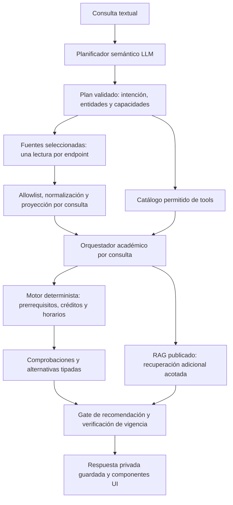

# Tools deterministas de pre-matrícula

Implementación basada en [GobIA — Informe de pre-matrícula](../sources/GobIA_TF_Informe_PreMatricula.md), especialmente el RAG agéntico acotado y el motor determinista de §5.2. Complementa [Contexto académico mínimo](academic-context-minimization.md).

## Arquitectura



Hay **un orquestador académico por consulta**, con un paso auxiliar de planificación semántica: dos responsabilidades LLM. No hay agentes persistentes ni agentes deterministas independientes. Hay **12 tools en el catálogo**, de las cuales diez consultan/calculan datos académicos de forma determinista y dos acceden al RAG compartido. El agente ve solo las herramientas permitidas para esa intención.

La interpretación de lenguaje, entidades, preferencias y redacción corresponde a la LLM. El planificador recibe únicamente `{query}`. La privacidad, selección de fuentes, proyección, reglas ejecutables, cálculos y límites se aplican en código. Los tipos RAW originales de `UI/types-SUM` permanecen intactos.

## Catálogo implementado

| Tool | Responsabilidad | Información expuesta |
|---|---|---|
| `get_completed_credits` | Consultar total derivado | Total aprobado o `null`; nunca todas las notas |
| `get_course_results` | Consultar el resultado solicitado | Cursos solicitados; nota/periodo solo en `GRADE_QUERY` |
| `get_course_prerequisites` | Consultar relaciones directas | Definiciones de los cursos solicitados, sin historia privada |
| `validate_prerequisites` | Comprobar cumplimiento | Estados relacionados y semántica revisada; `VALID`, `INVALID` o `UNKNOWN` |
| `get_course_schedules` | Consultar secciones autorizadas | Cursos/secciones seleccionados; datos de aula solo para consulta de horario |
| `detect_schedule_conflicts` | Calcular cruces | Intervalos del mismo día; selección ambigua devuelve `UNKNOWN` |
| `validate_credit_load` | Sumar créditos y comprobar límite | Créditos de cursos seleccionados y límite revisado |
| `simulate_enrollment` | Validar y comparar combinaciones | Prerrequisitos, carga, cruces y preferencias explícitas; hasta tres alternativas |
| `list_pending_courses` | Consultar pendientes derivados | Lista derivada y bandera `progressVerified`; no historial completo |
| `list_available_courses` | Validar cursos ofrecidos individuales | Candidatos con su estado explícito; no certifica una combinación conjunta |
| `get_institutional_rules` | Leer evidencia compartida | Hasta tres fragmentos publicados, 800 caracteres cada uno |
| `search_institutional_rules` | Recuperar evidencia adicional | Una búsqueda dentro de las mismas publicaciones/generaciones fijadas |

Las tools académicas aceptan `{}` o el marcador constante `{scope:"current_query"}`. No aceptan propietario, conexión, código de curso adicional, fuente, URL, notas, tokens ni reglas. Ese marcador evita una optimización de LangChain que omite la validación de esquemas sin campos. Las propiedades inesperadas se rechazan antes de ejecutar la herramienta.

La búsqueda RAG admite únicamente `{search_query: string}` de 3–300 caracteres; el servidor fija documentos y generaciones. Una segunda invocación reutiliza la respuesta almacenada y no genera otro embedding. La unión de evidencia conserva un máximo de tres fragmentos. No permite lecturas adicionales de SUM.

No existe una tool genérica que entregue todo el contexto. La ruta administrativa conserva su catálogo independiente.

## Planes y proyecciones

Se añadieron tres intenciones al contrato existente:

- `CHECK_SCHEDULE_CONFLICTS`: solo programación.
- `CHECK_CREDIT_LOAD`: solo plan y reglas institucionales.
- `SIMULATE_ENROLLMENT`: historia, plan, programación y reglas, siempre proyectados por curso.

`entities` ahora permite `sections` (referencia exacta de curso y sección) y, solo para simulación, `preferences`: `avoidDays`, `earliestStartMinutes`, `latestEndMinutes`, `preferredMaxCredits`. Son restricciones extraídas de texto explícito, nunca supuestas. Máximo cinco referencias de curso en conjunto. Las secciones deben pertenecer a esas referencias.

Ejemplos ilustrativos de salida del planner y contexto, sin afirmar precisión semántica de un modelo externo:

### 1. «¿Cuántos créditos he aprobado?»

```json
{"intent":"COMPLETED_CREDITS","entities":{},"requirements":["ACADEMIC_HISTORY"]}
```

```json
{"academicHistory":{"completedCredits":142}}
```

Tool: `get_completed_credits`. Si la política de calificación o la completitud no están verificadas, el total es `null`.

### 2. «¿Qué horario tiene Inteligencia Artificial, sección 1?»

```json
{"intent":"GET_COURSE_SCHEDULE","entities":{"courseNames":["Inteligencia Artificial"],"sections":[{"courseName":"Inteligencia Artificial","section":1}]},"requirements":["ACADEMIC_PROGRAMMING"]}
```

```json
{"academicProgramming":{"courses":[{"courseCode":"IA","courseName":"Inteligencia Artificial","section":1,"schedule":[{"day":"LUNES","start":"08:00","end":"10:00","room":"A101","type":"T"}]}]}}
```

Tool: `get_course_schedules`. Sin historia, notas ni otras secciones.

### 3. «¿Hay cruces entre IA sección 1 y BD sección 2?»

```json
{"intent":"CHECK_SCHEDULE_CONFLICTS","entities":{"courseCodes":["IA","BD"],"sections":[{"courseCode":"IA","section":1},{"courseCode":"BD","section":2}]},"requirements":["ACADEMIC_PROGRAMMING"]}
```

```json
{"academicProgramming":{"courses":[{"courseCode":"IA","courseName":"Inteligencia Artificial","section":1,"schedule":[{"day":"LUNES","start":"08:00","end":"10:00"}]},{"courseCode":"BD","courseName":"Base de Datos","section":2,"schedule":[{"day":"LUNES","start":"09:00","end":"11:00"}]}]}}
```

Tools: horarios y `detect_schedule_conflicts`. No aulas, tipo de clase, historial o notas.

### 4. «¿La carga de IA y BD excede el límite?»

```json
{"intent":"CHECK_CREDIT_LOAD","entities":{"courseCodes":["IA","BD"]},"requirements":["STUDY_PLAN","INSTITUTIONAL_RULES"]}
```

```json
{"studyPlan":{"courses":[{"courseCode":"IA","courseName":"Inteligencia Artificial","credits":4},{"courseCode":"BD","courseName":"Base de Datos","credits":4}]},"institutionalRules":{"chunks":[{"citationId":"00000000-0000-4000-8000-000000000001","text":"Fragmento institucional publicado de ejemplo."}]}}
```

Tool: `validate_credit_load`. Sin historia, programación ni grafo de prerrequisitos.

### 5. «Simula CO e IA sin clases los sábados»

```json
{"intent":"SIMULATE_ENROLLMENT","entities":{"courseCodes":["CO","IA"],"preferences":{"avoidDays":["SABADO"]}},"requirements":["ACADEMIC_HISTORY","STUDY_PLAN","ACADEMIC_PROGRAMMING","INSTITUTIONAL_RULES"]}
```

```json
{
  "academicHistory":{"courses":[{"courseCode":"CO","status":"NOT_TAKEN"},{"courseCode":"IA","status":"NOT_TAKEN"},{"courseCode":"PR","status":"PASSED"}]},
  "studyPlan":{"courses":[
    {"courseCode":"CO","courseName":"Compiladores","credits":4,"group":"--","prerequisites":[{"courseCode":"PR","courseName":"Programación","group":"--","credits":0}]},
    {"courseCode":"IA","courseName":"Inteligencia Artificial","credits":4,"group":"--","prerequisites":[]},
    {"courseCode":"PR","courseName":"Programación","group":"--","prerequisites":[]}
  ]},
  "academicProgramming":{"courses":[
    {"courseCode":"CO","courseName":"Compiladores","section":1,"schedule":[{"day":"LUNES","start":"08:00","end":"10:00"}]},
    {"courseCode":"IA","courseName":"Inteligencia Artificial","section":1,"schedule":[{"day":"MARTES","start":"08:00","end":"10:00"}]}
  ]},
  "institutionalRules":{"chunks":[{"citationId":"00000000-0000-4000-8000-000000000001","text":"Fragmento institucional publicado de ejemplo."}]}
}
```

Los ancestros conservan solo relaciones; sus créditos no se envían. Las preferencias están en el plan validado del servidor y se usan por el motor. El mensaje de usuario del agente sigue siendo `{query,context}`; las tools devuelven resultados tipados, nunca RAW.

## Motor y reglas

`EnrollmentEngine` no tiene modelo, acceso HTTP, base de datos ni SUM. Usa únicamente plan validado, proyección mínima y política revisada aplicable.

- Prerrequisitos: comprueba relaciones directas y estados relevantes. No interpreta `GEG`, requisitos por grupo o créditos acumulados; devuelve `UNKNOWN` ante esa semántica no implementada. No supone AND/OR a partir de los RAW: requiere `prerequisite_operator="ALL"` revisado.
- Carga: suma mediante `Decimal`, sobre cursos únicos seleccionados; usa solo un máximo registrado. Un máximo preferido explícito puede reducir ese límite.
- Cruces: intervalos semiabiertos por día. Horarios ausentes, inconsistentes o varias secciones sin selección explícita no justifican afirmar ausencia de cruces.
- Simulación: hasta cinco cursos, 64 combinaciones y tres alternativas. Orden: menor tiempo libre entre clases y, en empate, orden de códigos/secciones. `truncated=true` impide afirmar exhaustividad u óptimo global.
- Cursos disponibles: valida candidatos ofrecidos individualmente. `VALID` global significa que existe al menos un candidato validado; cada curso conserva su propio estado y los desconocidos no se recomiendan.

La política `ReviewedEnrollmentPolicy` se carga desde `STUDENT_RULES_FILE`, junto al registro legado. Campos: `kind="pre_enrollment"`, `rule_id`, `version`, `reviewed_by`, `description`, `applicability_verified=true`, facultad/escuela/especialidad, `curriculum`, `academic_period`, operador `ALL`, `max_credits`, `citation_ids` y `generation_ids`. No se instala una regla sintética ni un límite por defecto. El registro admite hasta 50 entradas y 64 KiB; duplicados o aplicabilidad ambigua fallan de forma segura.

El gateway puede proporcionar `policyScope` con facultad, escuela, especialidad, plan y periodo verificados por el servidor. Es metadato de la envoltura: **nunca entra al prompt**. Para consultas normativas, solo se aplica una política cuyo ámbito y evidencias/generaciones publicadas coincidan. Para una comprobación pura de prerrequisitos, la semántica revisada puede resolverse con el ámbito del servidor sin cargar RAG ni emitir citas normativas; no se certifican límites de matrícula.

Sin política revisada o ámbito verificable, el resultado es `UNKNOWN`. `VALID` de prerrequisitos no prueba elegibilidad integral, oferta vigente ni matrícula oficial. La simulación cubre las restricciones implementadas; equivalencias, excepciones, cupos, grupos y otras reglas requieren desarrollo y revisión posteriores.

## Contratos de resultado, UI y auditoría

`DeterministicResult` es estricto e incluye:

- `status: VALID | INVALID | UNKNOWN`, `engineVersion: pre-enrollment-v1`, motivos cerrados.
- Comprobaciones de prerrequisitos, cruces e identificadores de secciones.
- Créditos/límite, versión e identificador de regla y citas observadas.
- Hasta tres alternativas, combinaciones examinadas, truncamiento y criterios de ordenación.

`StudentAnalysis.deterministic_results` conserva hasta seis resultados calculados por el servidor. El modelo no puede generarlos dentro de `StructuredAnswer`. Backend verifica sus citas contra la evidencia autorizada y los guarda con la respuesta privada. La UI los valida con Zod y muestra comprobaciones y alternativas usando los componentes y estilos existentes de DESIGN.md. No ejecuta JSX ni código generado por el modelo.

Antes de recomendar se exige que la tool crítica de la intención haya devuelto `VALID`. Si no se llamó, falló, o devolvió `UNKNOWN`/`INVALID`, se publica abstención y las comprobaciones disponibles. No hay acciones oficiales de matrícula ni credenciales de escritura.

Se auditan inicio/fin/error, caché, duración, tamaño, estado, versión de motor/regla y hash del resultado. El resultado detallado permanece en la respuesta privada guardada. Las excepciones no se serializan en eventos ni se reenvían con datos de entrada. Se mantienen cuotas por usuario y presupuesto acumulado existentes; máximo seis llamadas de tools y tres llamadas de composición, además de una planificación. Las recuperaciones adicionales conservan cuotas de embeddings y publicaciones fijadas.

## Archivos de esta ampliación

Creados:

- `packages/contracts/src/sum_contracts/student_base.py`: base estricta compartida.
- `packages/contracts/src/sum_contracts/enrollment.py`: políticas/resultados deterministas.
- `services/ai-service/src/sum_ai/enrollment_engine.py`: motor puro y acotado.
- `services/ai-service/src/sum_ai/student_tools.py`: catálogo por intención, límites, caché y auditoría.
- `UI/src/lib/student/deterministic-results.ts`: resultados Zod y etiquetas de UI.
- `tests/test_student_tool_boundaries.py`: privacidad y límites de herramientas.
- Esta documentación y `docs/superpowers/plans/2026-10-03-prematricula-tools.md`.

Modificados: contratos académicos Python/TypeScript, contratos de estudiante, planners, builder/proyecciones, `StudentSession`, `StudentOrchestrator`, puerto/gateway SUM, verificación de citas en `ai_repository.py`, componente `student-result.tsx` y documentación previa. Los tres tipos RAW no se editaron.

## Comprobaciones y pendientes

Pruebas focalizadas: **19 TypeScript y 16 Python aprobadas**. Verifican minimización A–E, proyecciones nuevas, selección de sección, argumentos prohibidos, catálogo por intención, ausencia de aprobación sin política, caché/límites, auditoría segura y una sola búsqueda adicional. Typecheck acotado, con el alias `#/*` configurado, aprobado.

```sh
# UI
node --import ./tests/unit/register.mjs --test tests/unit/academic-context.test.mjs
# Raíz
uv run --no-sync pytest tests/test_academic_minimization.py tests/test_student_tool_boundaries.py -q
```

No son pruebas funcionales de la simulación ni de comprensión semántica de una LLM. No se ejecutó suite global, build, SUM ni modelos. Siguen pendientes SUMAdapter, ámbito/completitud del adapter, política de calificación, instalación de reglas institucionales revisadas y la evaluación funcional autorizada posteriormente. MCP propio permanece como integración futura; no se conectó un servidor MCP.
