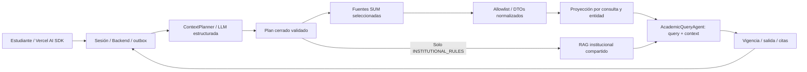

# Asistente del estudiante

Implementación inicial con el diseño visual de [DESIGN.md](../DESIGN.md). SUMAdapter está pendiente; los tipos RAW SUM se conservan en UI/types-SUM; la aplicación no presenta un expediente ficticio como real.

## Acceso

- `/assistant`: consulta, contexto opcional, citas, progreso, cancelación e historial paginado.
- `/assistant/{runId}`: recuperar una respuesta o reconectar a una ejecución.
- `/connections/sum`: estado explícito de integración pendiente.
- `/login?mode=student`: sesión Better Auth existente. El registro público sigue deshabilitado; provisionar cuentas mediante la API de servidor Better Auth, con rol `user`.

El proxy exige sesión real y firma sujeto, rol, método, ruta, hash del cuerpo y vencimiento. Backend usa `student:SHA256(subject)` como propietario y clave de cuota. Las consultas y conexiones de proveedores administrativas no son seleccionables por el estudiante. No se utiliza la identidad temporal del panel administrativo.

`@ai-sdk/react` 3 y `ai` 6 proporcionan `useChat` y `DefaultChatTransport`. Backend produce UI Message Stream v1. El cliente envía únicamente la última pregunta y opciones: cada consulta es independiente, aunque la UI muestre varias respuestas.

## Agentes y herramientas

La arquitectura de contexto, esquemas finales, ejemplos y pruebas se describen en [Contexto académico mínimo por consulta](academic-context-minimization.md).

**Responsabilidades no deterministas:** toda interpretación de intención, cursos y periodo y redacción. El planner recibe solo `{query}`, mediante LangChain `ToolStrategy`. No hay regex para interpretar consultas. Ambigüedad utiliza `OTHER` y solicita aclaración sin consultar SUM.

**Responsabilidades deterministas:** identidad, consentimiento, cuotas, expiración, esquema/categorías permitidas, mappers, proyecciones, conteos y citas. El modelo no elige propietario, conexión, SQL, URL de gateway ni campos RAW. Clasificador y agente comparten el presupuesto existente: cinco llamadas, 8 000 tokens estimados de entrada acumulados, 1 000 de salida y 120 segundos. La planificación se limita a una llamada; la composición a tres y hasta seis llamadas de herramientas.

El catálogo contiene diez tools académicas y dos de RAG, con allowlist por intención. Las tools académicas usan la proyección ya seleccionada, caché y lock; no pueden ampliar el plan. El motor verifica prerrequisitos, carga, cruces y simulaciones de hasta 64 combinaciones. La respuesta incluye resultados tipados calculados por el servidor y bloquea recomendaciones sin resultado `VALID`. Ver [tools, esquemas, ejemplos y límites](pre-enrollment-tools.md).

La ruta de estudiante no expone el snapshot completo ni la antigua herramienta de evaluación basada en él. La ruta administrativa conserva sus herramientas de investigación.

Las consultas puramente SUM omiten RAG y se identifican con `StudentAnalysis.answer_basis=sum_projection`; las normativas necesitan evidencia publicada y citas válidas. Contexto RAW y valores académicos no se escriben en eventos de contexto. LangSmith oculta inputs/outputs.

La respuesta aparece después de validarse. El stream de progreso solo devuelve etapas públicas, tiempos y nombres de herramientas. La desconexión no cancela el workflow; la reconexión reproduce eventos por secuencia y consulta el resultado. La cancelación es cooperativa: una llamada ya enviada puede consumir tokens.

## Cuotas por usuario

| Variable | Inicial |
|---|---:|
| `STUDENT_REQUESTS_PER_MINUTE` | 5 |
| `STUDENT_REQUESTS_PER_DAY` | 50 |
| `STUDENT_TOKENS_PER_MINUTE` | 20 000 |
| `STUDENT_TOKENS_PER_DAY` | 100 000 |

Lua atómico en Redis controla admisión y reservas. Los días son UTC. Las llamadas al modelo y embeddings comparten tokens del estudiante y límites globales de proveedor: 30 llamadas/minuto y cuatro simultáneas. Redis no disponible impide llamadas de pago. Las reservas se liquidan una vez por ID; errores del proveedor mantienen una carga conservadora. Los rechazos se registran en métricas por propietario. `429` incluye `Retry-After`, que deshabilita temporalmente nuevas consultas en UI.

`STUDENT_AI_PROVIDER` y `STUDENT_AI_MODEL` son decisiones del servidor, por defecto `ollama` y `llama3.2`; deben pertenecer a `AI_MODELS_JSON` y estar disponibles. Los límites de tokens/solicitudes no equivalen a un saldo monetario: las tarifas pueden variar y Redis actual no persiste cuotas entre reinicios.

## Contrato del futuro SUMAdapter

`ACADEMIC_GATEWAY_URL` vacío mantiene deshabilitada la integración. El contrato anterior de `AcademicSnapshot` fue reemplazado por `academic-context-v2`. Ver [gateway, supuestos y ejemplos](academic-context-minimization.md#gateway-y-condiciones-pendientes).

`HttpAcademicGateway` envía consulta y plan validado a `POST /internal/academic-context`, con autenticación del servicio y selectores privados de propietario/conexión. La envoltura tiene fuente, snapshot y fechas fuera del prompt; `context` contiene solamente las categorías y campos proyectados. Los documentos institucionales se recuperan en el RAG compartido del AI service.

`createAcademicGatewayHandler` proporciona una frontera HTTP montable con autorización y resolución de sesión inyectadas. Falta implementarla/montarla con el SUMAdapter real, verificación de propiedad/consentimiento, selección del periodo, recopilación completa y política de calificación revisada. Las credenciales SUM nunca forman parte del chat. `StudentSession` exige conexión y consentimiento para consultar fuentes SUM.

Los tipos RAW originales no se modifican. No se supone el umbral de aprobación, el significado de claves `creditaje` ni reglas AND/OR de grupos. Sin política revisada se conserva `UNKNOWN`; sin historia completa no se afirma un total definitivo. Las definiciones de currículo se obtienen/cachean como conocimiento institucional compartido, usando el plan del estudiante solo como selector privado.

## Reglas institucionales revisadas

`STUDENT_RULES_FILE` admite reglas legadas y políticas `pre_enrollment` revisadas/versionadas. El registro está vacío por defecto. Su aplicabilidad se comprueba contra `policyScope` del servidor y, para consultas normativas, las publicaciones/citas recuperadas. Sin regla aplicable se devuelve `UNKNOWN`. No se convierte texto RAG en reglas ejecutables ni se certifica matrícula oficial.

`StudentAnalysis.deterministic_results` conserva resultados del motor en la respuesta privada guardada; la UI valida y muestra comprobaciones y alternativas sin código generado por el modelo.

## Auditoría y observabilidad

Backend conserva pregunta/opciones privadas, run, outbox, eventos secuenciales, selección de evidencia, herramientas, uso por llamada, etapas y resultado. Inngest lleva solo versión e ID de ejecución. AI Service utiliza callbacks autenticados y no escribe tablas privadas de Backend. Los reintentos mantienen el presupuesto durable y prefijos de intento diferentes. La validación de IDs de citas no prueba por sí sola exactitud semántica; sigue siendo necesaria revisión de orientación académica.

Opcionalmente configurar `LANGSMITH_TRACING=true`, `LANGSMITH_API_KEY`, `LANGSMITH_PROJECT`. Un cliente con `hide_inputs=True` y `hide_outputs=True` correlaciona consulta, traza, hash del propietario y versión de política. El `trace_id` también se guarda localmente con observabilidad externa deshabilitada. PostgreSQL mantiene la auditoría durable.

## Componentes y futura integración MCP

`StudentAnalysis.components` admite solo `sources`, `context_status`, `rule_checks`, `next_steps`. Un registro React renderiza datos Pydantic/Zod validados; cada cita se expande desde la evidencia ya recibida, sin peticiones por documento. Se puede descargar respuesta y fuentes.

No se conectó un servidor MCP. Sus futuras herramientas deben convertirse a estos contratos y pasar por propiedad, presupuesto, auditoría y allowlist. No se ejecuta JSX/HTML/JavaScript del modelo; nuevas acciones requieren contratos propios de aplicación.

## Validación de esta entrega

La entrega inicial de UI conservó DESIGN.md y capturas en `artifacts/student-ui`. El rediseño posterior añade pruebas automatizadas focalizadas de minimización, expresamente solicitadas por el usuario, además de typecheck limitado a los módulos nuevos y lint de archivos afectados.

No se ejecutan build completo, suite global, SUM real ni llamadas a modelos de pago. El detalle de pruebas y limitaciones está en [Contexto académico mínimo por consulta](academic-context-minimization.md#auditoría-y-pruebas).
