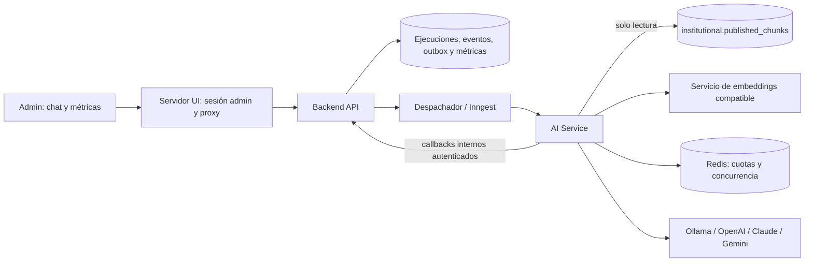

# Arquitectura integral del AI Service y la consola administrativa de RAG

Fecha: 2026-10-03  
Estado: especificación para revisión

## 1. Propósito y alcance

Implementar un AI Service independiente para consultar el corpus institucional ya indexado y probar RAG agente desde el panel administrativo. Una persona administradora debe poder elegir entre modelos configurados de Ollama, OpenAI, Anthropic Claude y Google Gemini; hacer una pregunta; inspeccionar respuesta, citas y pasos observables; y consultar métricas operativas y de calidad en otra pestaña.

La clave de esta entrega es la auditabilidad. Cada prueba debe crear una ejecución durable con evidencia, versiones, uso, tiempos y errores suficientes para revisar el resultado. El servicio se diseña para admitir después un flujo estudiantil con políticas distintas, pero **esta entrega implementa solo el flujo administrativo**. No incluye interfaz estudiantil, datos privados de SUM ni SUM Gateway.

El corpus de prueba son las versiones **publicadas** en PostgreSQL/pgvector. La biblioteca de muestras local del navegador no interviene en la recuperación del AI Service.

## 2. Estado actual y decisiones

- Backend API ya autentica solicitudes administrativas con token, administra documentos y publicaciones, y utiliza outbox e Inngest para indexación.
- Indexer Service escribe fragmentos y vectores; `institutional.published_chunks` expone solo generaciones completas y publicadas al rol de recuperación.
- `/admin/chat` y `/admin/search` usan actualmente coincidencia léxica sobre datos locales. El panel tiene un proxy de servidor para Backend API, pero la ruta `/admin` no verifica todavía una sesión administrativa.
- `docs/separacion-servicios.md` y `docs/arquitectura-detallada-estudiante.md` reservan AI Service como proceso independiente. Esta especificación concreta primero la variante administrativa.

Decisiones de diseño:

1. Backend API sigue siendo la entrada pública y el dueño del estado de ejecuciones. AI Service ejecuta el flujo y lee el corpus mediante una credencial de solo lectura.
2. Todas las consultas administrativas usan un registro durable y eventos ordenados. La vista puede sentirse interactiva aunque el procesamiento se despache por Inngest.
3. LangChain coordina dos agentes acotados: investigación con selección de herramientas por modelo y redacción con salida estructurada. La recuperación inicial, las herramientas, los límites y la validación final están determinados por código.
4. La selección de proveedor/modelo llega como identificador de un catálogo permitido por el servidor. “Codex” significa un modelo de OpenAI disponible mediante la API de OpenAI; no se invoca el CLI local.
5. El panel muestra métricas de tráfico real y de evaluación etiquetada por separado. Recall no se estima a partir de consultas sin verdad de referencia.

## 3. Componentes y límites

### Servidor UI

Verifica una sesión Better Auth y una lista de administradores permitidos antes de aceptar solicitudes de IA. Valida origen y método, conserva las credenciales del backend en el servidor y nunca entrega claves de proveedores al navegador. Envía al backend una afirmación de identidad administrativa firmada y breve; el backend rechaza identidades libres o sin firma. El panel ofrece `/admin/chat` y `/admin/metrics`.

### Backend API

Valida entrada, identidad, idempotencia y cuota de solicitudes; crea ejecución y outbox en una transacción; expone estado, eventos SSE, resultado y agregados de métricas. Recibe callbacks internos idempotentes de AI Service. Rechaza resultados posteriores a cancelación, vencimiento o finalización. Su esquema `application` conserva los artefactos privados y la bitácora de auditoría.

### AI Service

Proceso FastAPI interno con configuración, recursos y concurrencia propios. Obtiene el contexto de una ejecución desde Backend API mediante token de servicio, lee el corpus con `sum_retrieval_access`, ejecuta las herramientas permitidas y devuelve eventos/resultados al backend. No escribe tablas de `application` ni de `institutional` directamente. No acepta SQL, URL o código arbitrario procedente del modelo.

### Infraestructura

Inngest entrega referencias de ejecución, nunca preguntas ni respuestas, y permite reintentos acotados. Redis coordina cuotas y concurrencia entre réplicas; si no está disponible, se detienen las llamadas a modelos para impedir gasto sin control. PostgreSQL sigue siendo la fuente durable de ejecuciones y auditoría. Un agregador construye métricas a partir de eventos ya guardados, fuera de la solicitud de la pestaña.

## 4. Contratos y ciclo de vida administrativo

### API pública administrada por Backend API

| Método y ruta | Contrato |
|---|---|
| `GET /v1/admin/ai/models` | Devuelve proveedor, modelo, disponibilidad y capacidades de los modelos configurados; nunca secretos. |
| `POST /v1/admin/ai/runs` | Recibe `question` de 3–2000 caracteres, `provider`, `model`, `document_ids` opcionales (máximo 20 UUID) y `top_k` de 1–10. Exige `Idempotency-Key`. Devuelve `202`, `run_id`, estado y URL de eventos. |
| `GET /v1/admin/ai/runs` | Lista ejecuciones paginadas y filtradas para abrirlas desde chat o métricas. |
| `GET /v1/admin/ai/runs/{run_id}` | Devuelve estado, resultado estructurado y auditoría permitida al administrador propietario. |
| `GET /v1/admin/ai/runs/{run_id}/events` | SSE autorizado, con secuencia y reproducción desde `Last-Event-ID`. |
| `POST /v1/admin/ai/runs/{run_id}/cancel` | Solicita cancelación cooperativa e idempotente. |
| `GET /v1/admin/ai/metrics` | Devuelve agregados paginados o acotados por período, modelo, proveedor y versión del corpus. |
| `GET /v1/admin/ai/evaluations` | Devuelve resultados de conjuntos etiquetados y sus versiones; no mezcla evaluación con tráfico real. |
| `POST /v1/admin/ai/evaluations` | Inicia una evaluación de un conjunto versionado instalado en el servidor, con modelo permitido y prioridad baja; devuelve `202` e ID de evaluación. |

El proxy del servidor UI expone rutas equivalentes bajo `/api/ai/*`. No transmite un token de portador en URL. El navegador consume SSE mediante un cliente que puede enviar las credenciales de sesión, o mediante el proxy del mismo origen.

La ejecución sigue `queued → running → completed | failed | cancelled`. Las etapas observables son `validating`, `retrieving`, `researching`, `composing` y `verifying`. Backend API persiste cada evento antes de transmitirlo. Desconectar SSE no cancela ni repite el trabajo.

El resultado final contiene `answer`, `citations`, `evidence`, `provider`, `model`, `usage`, `timings`, `tool_trace` y `limitations`. Cada cita apunta a `document_id`, `version_id`, `generation_id`, `chunk_id`, página y localizador existentes en la evidencia de esa ejecución. Los errores usan códigos seguros y no incluyen cuerpos de proveedor, secretos ni prompts.

### Contratos internos

AI Service recibe solo `run_id`; consulta el contexto autorizado en Backend API. Los callbacks `started`, `stage`, `evidence`, `tool`, `usage`, `completed` y `failed` llevan `run_id`, `operation_id` estable y versión de contrato. Backend API deduplica por operación, comprueba transición y persiste estado, artefactos y evento en la misma transacción cuando corresponde. El resultado de Inngest contiene únicamente identificadores.

## 5. Flujo RAG agente

1. Validar la solicitud y reservar capacidad/cuota antes de cualquier llamada con costo.
2. Leer las generaciones publicadas incluidas en el alcance solicitado; identificar perfiles de embeddings presentes.
3. Generar el embedding de la pregunta para cada perfil compatible y ejecutar búsqueda vectorial parametrizada. La recuperación inicial es obligatoria y no depende de una decisión del modelo. Si no hay evidencia suficiente, devolver una abstención con motivo y sin llamada al modelo de respuesta.
4. Entregar evidencia acotada a `ResearchAgent`, creado con LangChain `create_agent`. El modelo puede solicitar hasta dos rondas de herramientas adicionales: `search_published_chunks`, `get_published_chunk_context` y `get_publication_metadata`. Cada herramienta valida argumentos, propiedad y límites, y retorna datos estructurados de versiones publicadas. Su ejecución es determinista para una entrada y generación dadas; el modelo decide si llamarlas.
5. Entregar únicamente la evidencia seleccionada a `AnswerAgent`, también coordinado por LangChain, sin herramientas. Produce una respuesta estructurada con texto, citas por identificador y limitaciones. Validar mediante Pydantic y una comprobación independiente: citas presentes en evidencia, versión publicada, longitud, formato y ausencia de referencias inventadas. Ante una salida inválida se permite una reparación acotada; si falla, terminar con abstención segura.
6. Guardar respuesta, evidencia, traza observable y uso a través de Backend API. Liberar reservas de concurrencia y ajustar la cuota de tokens con el uso real.

El texto recuperado es dato no confiable: no modifica herramientas, políticas ni instrucciones. No se almacenan ni muestran razonamientos internos del modelo. La traza registra solicitudes de herramientas y sus resultados acotados, no una explicación inventada de por qué el modelo las eligió. Las comprobaciones de reglas académicas no se improvisan desde texto recuperado; esta entrega no registra reglas de elegibilidad estudiantil. Cada ejecución fija los IDs de generación de sus publicaciones. Antes de una recuperación adicional, la herramienta comprueba que esos IDs siguen publicados; si cambian, termina con `CORPUS_CHANGED` para evitar mezclar versiones y permite un único reinicio completo sujeto al plazo global.

### Recuperación y compatibilidad de embeddings

AI Service usa `institutional.published_chunks` y el contrato `EmbeddingProfile`. Cada consulta de embedding aplica el prefijo de consulta, modelo, revisión y dimensión del perfil que generó los fragmentos. Si hay varios perfiles publicados, calcula un vector por perfil compatible, limita el número de perfiles por ejecución y combina rankings por posición para evitar comparar puntuaciones de modelos distintos. Un perfil sin adaptador configurado produce un estado explícito `EMBEDDING_PROFILE_UNAVAILABLE`; no se omite silenciosamente. Las consultas SQL son parametrizadas y usan los índices adecuados a cada dimensión admitida. El cache de embeddings de consulta se identifica por hash del texto normalizado, perfil completo y generación del corpus, con vencimiento corto; la pregunta no aparece en claves de Redis.

## 6. Proveedores y costos

Un registro de modelos del servidor define identificadores permitidos, proveedor, credencial, capacidad de herramientas/salida estructurada, máximo de tokens, tiempo de espera y disponibilidad. Se implementan adaptadores LangChain para Ollama, OpenAI, Anthropic y Google. El selector del panel muestra solo configuraciones válidas; seleccionar otro modelo no cambia los embeddings del índice. No hay sustitución silenciosa de proveedor ante un fallo.

Límites iniciales configurables por ejecución: cinco llamadas al modelo en total (hasta tres de investigación, una de redacción y una de reparación), seis llamadas a herramientas, dos rondas de seguimiento, ocho fragmentos en el contexto final, 8 000 tokens de entrada estimados, 1 000 tokens de salida y 120 segundos totales. Una llamada externa tiene su propio límite: base de datos 3 s, embeddings 10 s, modelo 30 s y callbacks internos 5 s. Se permite como máximo un reintento de error transitorio dentro del plazo global; validaciones fallidas no se reintentan salvo la reparación estructurada indicada arriba.

Redis aplica cuotas compartidas de solicitudes y tokens por administrador y por proveedor/modelo, más un semáforo por proveedor. Valores iniciales: 10 consultas por minuto por administrador, 30 llamadas al modelo por minuto y cuatro llamadas simultáneas por proveedor; cada modelo puede bajar esos límites desde configuración. Se reserva un presupuesto estimado antes de llamar y se ajusta con el uso informado. Exceder cuota devuelve `429` y `Retry-After`; capacidad agotada o dependencia caída devuelve un error seguro. Se registran tokens reales y costo **estimado** según una tabla de precios configurable y fechada; no se presenta ese costo como factura del proveedor.

## 7. Auditoría y retención

Cada ejecución guarda identidad administrativa verificada, marca de prueba, pregunta privada, estado, fechas, versión de contrato, versión de instrucciones, proveedor/modelo, parámetros permitidos, perfil de embeddings, generación del índice y alcance documental. Los eventos append-only incluyen etapa, operación, herramienta, duración, código de resultado y referencias a artefactos. La evidencia conserva IDs de versión y fragmento, localizador, orden y puntuación/rango. El resultado conserva respuesta y citas. El uso conserva tokens y costo estimado.

La bitácora registra entradas/salidas de herramientas necesarias para revisar una prueba, con truncamiento y redacción de secretos. Nunca guarda claves API, cabeceras de autenticación, texto de razonamiento interno ni respuestas completas de proveedor en logs. La vista administrativa puede abrir una ejecución desde chat o métricas y reconstruir sus pasos observables. La auditoría hace revisable una respuesta; no promete que repetir una llamada a un modelo no determinista produzca texto idéntico.

Valores iniciales de retención en este entorno administrativo: ejecuciones, respuesta y evidencia durante 30 días; métricas agregadas sin pregunta durante 90 días; eventos de proveedor sin cuerpo durante 30 días. La purga es idempotente y elimina artefactos privados y referencias de cache. Los períodos son configurables; desplegar el futuro flujo estudiantil requiere definir su política propia antes de almacenar datos personales.

## 8. Pestaña de métricas y evaluación

`/admin/metrics` contiene filtros por intervalo, proveedor, modelo, perfil/generación del corpus y estado. Su primer bloque muestra volumen, éxito, abstenciones, `429`, fallos y tiempos de espera. El segundo muestra promedio, p50 y p95 de duración total y de cada etapa; uso de tokens, costo estimado y llamadas a herramientas. Cada punto permite abrir las ejecuciones auditadas que lo componen, sujeto a paginación y permisos.

El bloque de calidad muestra `recall@k`, `precision@k` y `MRR` solo para ejecuciones de un conjunto de evaluación etiquetado. Cada caso contiene pregunta y fragmentos relevantes vinculados a una generación del corpus. Los conjuntos son archivos JSON versionados instalados con el servicio y validados al arrancar; el panel permite iniciar su ejecución, no editar etiquetas durante una prueba. El conjunto y la ejecución de evaluación tienen versión. Una reindexación que cambia IDs de fragmentos invalida esas etiquetas hasta revisarlas. El evaluador ejecuta las mismas rutas y cuotas de AI Service con prioridad menor que las consultas interactivas. Sin etiquetas vigentes, la interfaz indica “sin evaluación etiquetada” y no fabrica recall. La validez sintáctica de citas se mide automáticamente; la corrección semántica o factual requiere revisión humana o una evaluación marcada como estimación.

Un proceso de métricas de Backend API consume los nuevos eventos durables con un cursor idempotente y actualiza agregados horarios, incluidos histogramas de latencia para p50/p95 aproximados. La petición HTTP de la pestaña consulta esos agregados, no recorre todas las ejecuciones. No se incluye texto de preguntas ni respuestas en series agregadas.

## 9. Interfaz administrativa

`/admin/chat` sustituye la vista previa local por consultas al backend. Presenta proveedor y modelo permitidos, filtro de documentos publicados, pregunta, estado de ejecución, respuesta, citas inspeccionables, evidencia usada, traza de herramientas, tiempo y tokens/costo estimado. Distingue abstención, cuota agotada, proveedor indisponible y fallo de recuperación. El botón de nueva conversación limpia la vista sin borrar la auditoría. Las pruebas anteriores se pueden abrir por `run_id` mientras estén dentro de retención.

`/admin/metrics` añade gráficos accesibles con tabla de datos equivalente, filtros y enlaces a ejecuciones. Los datos de evaluación se distinguen visual y textualmente del tráfico real. Los estados vacíos indican si faltan publicaciones, ejecuciones o etiquetas, según el caso.

## 10. Verificación y criterios de aceptación

- Una consulta desde `/admin/chat` crea una ejecución durable, retorna progreso y termina con respuesta citada o abstención explícita. El resultado se puede reabrir desde su `run_id`.
- Las citas apuntan exclusivamente a fragmentos de generaciones publicadas y del alcance solicitado. Si una publicación cambia durante la ejecución, las herramientas detectan el cambio y terminan con `CORPUS_CHANGED`; no mezclan generaciones.
- Cada proveedor configurado aparece en el selector y puede ejecutar el mismo contrato. Uno sin credenciales/capacidades válidas figura indisponible, sin filtrar secretos.
- La traza muestra etapas, herramientas, duraciones, versiones y uso; callbacks duplicados no crean eventos o uso duplicado en el registro. Si el proceso cae después de una respuesta del proveedor y antes de persistirla, un reintento puede generar un segundo cobro externo; el límite de reintentos y la auditoría de intentos acotan y hacen visible ese caso.
- Límites de entrada, cuota distribuida, presupuestos y tiempos de espera detienen llamadas antes de exceder los máximos configurados. Los errores llegan al panel con códigos seguros.
- La pestaña Métricas muestra promedio/p50/p95 por etapa y separa calidad etiquetada de tráfico real. Los gráficos concuerdan con los eventos auditados de una muestra de ejecuciones.
- La ruta de IA exige sesión administrativa verificada y el AI Service no es accesible desde la red pública. La cuenta SQL del servicio solo puede leer el corpus publicado.

La verificación de implementación cubrirá contratos y límites con proveedores falsos, recuperación contra PostgreSQL/pgvector, reintentos idempotentes, cuotas compartidas entre dos instancias, un recorrido administrativo completo y los cálculos de evaluación. No se enviarán preguntas reales ni datos privados a proveedores durante esas pruebas.

## 11. Orden de implementación y extensión futura

1. Contratos, tablas de ejecuciones/auditoría y autenticación de la ruta administrativa.
2. AI Service: configuración, catálogo de modelos, recuperación publicada, herramientas y agente acotado.
3. Despacho durable, callbacks y SSE desde Backend API.
4. Integración de `/admin/chat`, evidencias y traza.
5. Agregación de métricas, conjunto de evaluación etiquetado y `/admin/metrics`.
6. Ajuste de límites, observabilidad y documentación de despliegue.

El futuro estudiante usará el mismo núcleo de recuperación y proveedores, pero tendrá contrato, permisos, cuotas, retención y presentación propios. No se expondrán al estudiante el selector administrativo, trazas internas ni métricas globales. La integración con SUM Gateway sigue fuera de esta entrega.

## 12. Referencias técnicas

- Arquitectura vigente: [`ARQUITECTURA.md`](../../../ARQUITECTURA.md), [`docs/separacion-servicios.md`](../../separacion-servicios.md) y [`docs/arquitectura-detallada-estudiante.md`](../../arquitectura-detallada-estudiante.md).
- LangChain Python: [agentes](https://docs.langchain.com/oss/python/langchain/agents), [modelos](https://docs.langchain.com/oss/python/langchain/models), [middleware de límites](https://docs.langchain.com/oss/python/langchain/middleware/built-in) y [salida estructurada](https://docs.langchain.com/oss/python/langchain/structured-output).
